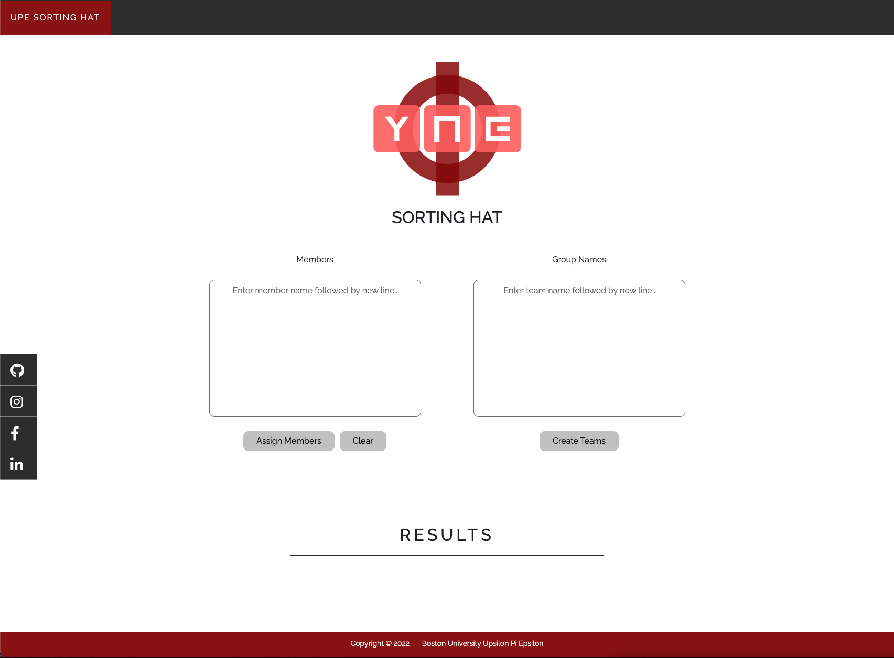
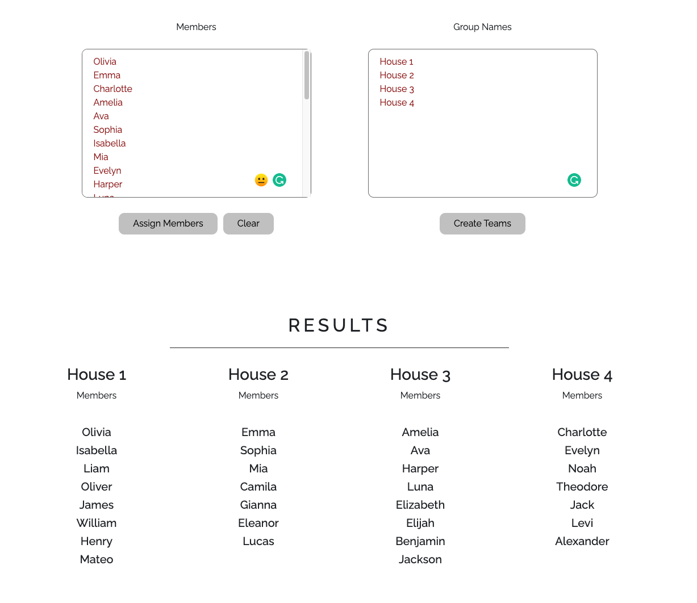

# House-Sorting-UPE-Project

URL of webpage --> https://tszwong.github.io/House-Sorting-UPE-Project/
 
Authors/Contributors: Tsz Kit Wong, Toby Ueno
 

This project is a contribution for Boston University's Upsilon Pi Epsilon. Provisional members of UPE are randomly placed in one of the four houses that consists current/full members. This Sorting Hat program is designed to make this assigning process seamless. Our main goals for designing this project was to create something that was visually appealing and created even-sized houses, both of which were major flaws of the random spinner. We accomplished this by implementing our very own house sorting algorithm/function onto an UPE themed webpage built from scratch.

 
** Preview **
  

  

